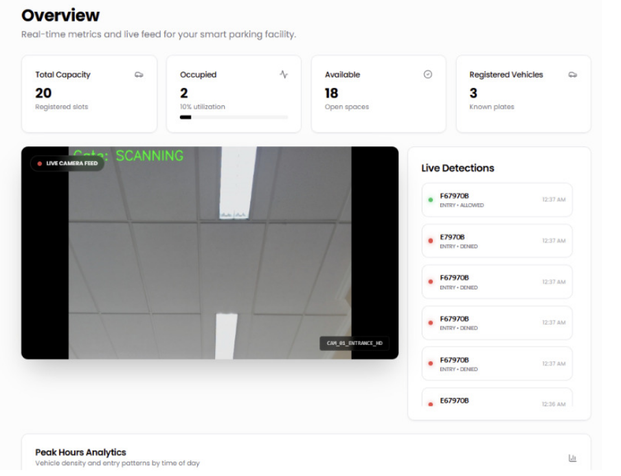
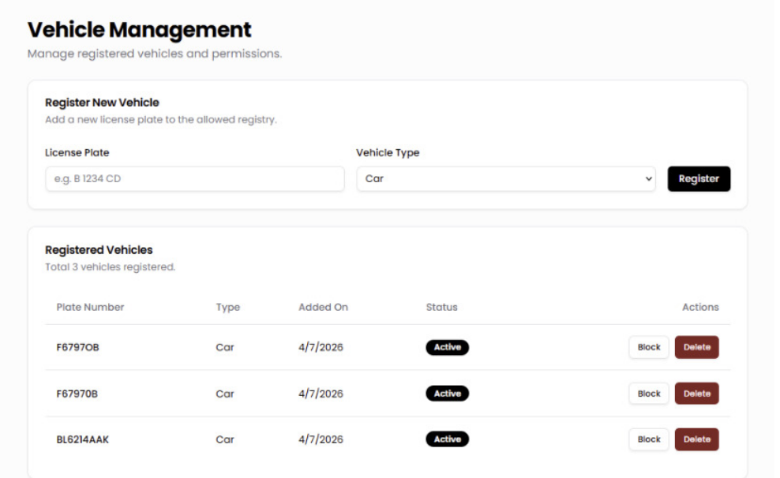
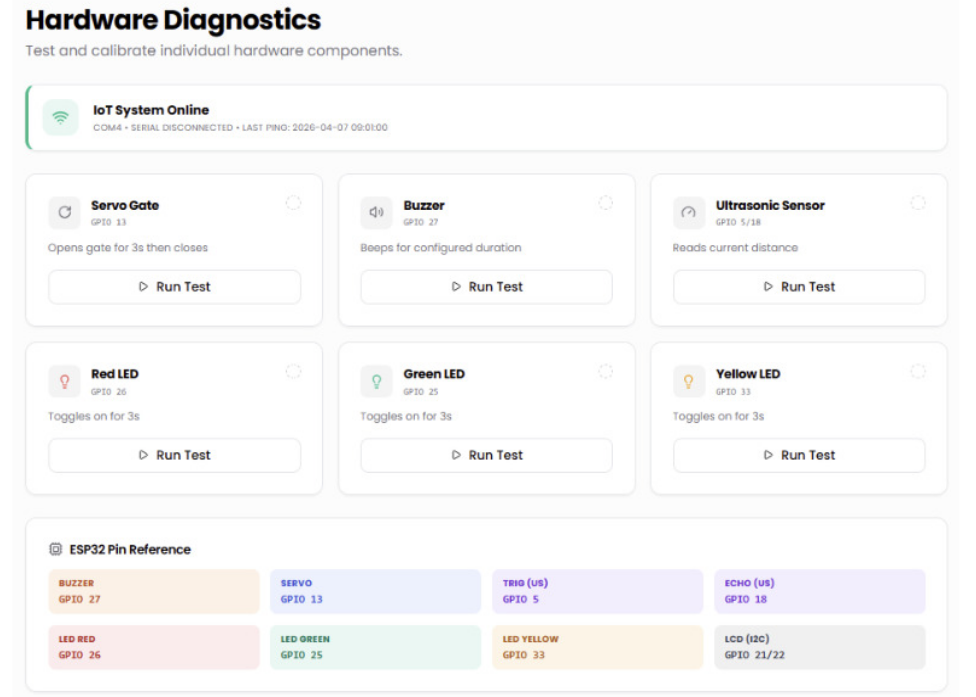
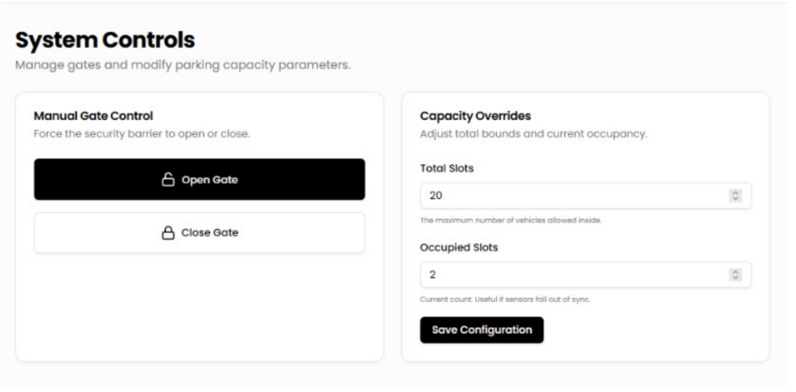

<div align="center">

# Smart Parking System

### Edge AI-Based License Plate Recognition and IoT Integration

An intelligent parking management system integrating **Computer Vision, OCR, Edge AI, and ESP32** for automated vehicle identification, gate control, and real-time parking monitoring.

<p>


</p>

</div>

---

# Project Preview

<p align="center">
  
</p>

---

# Overview

The Smart Parking System is an intelligent parking management solution that combines Edge AI, Computer Vision, Optical Character Recognition (OCR), and IoT technologies to automate vehicle identification and parking gate control.

The system performs real-time license plate detection using a YOLO-based object detection model followed by OCR character recognition. The recognized license plate is validated against a registered vehicle database before automatically controlling an ESP32-based parking gate.

To support parking operations, the project also includes a real-time web dashboard built with Flask-SocketIO for monitoring parking occupancy, registered vehicles, hardware status, and vehicle access logs.

---

# Features

- Real-time vehicle detection
- License plate detection using YOLO
- Optical Character Recognition (OCR)
- Edge AI local inference
- ESP32-based automated gate control
- Vehicle registration and validation
- Vehicle entry logging
- Parking occupancy monitoring
- Hardware diagnostics
- Manual gate control
- Real-time dashboard
- WebSocket communication
- Multi-threaded detection pipeline

---

# Dashboard

# Dashboard

<p align="center">
  
</p>

The web-based dashboard provides administrators with a centralized interface for monitoring and managing the smart parking system in real time. It displays parking occupancy, registered vehicles, access logs, hardware status, and gate control, enabling efficient operation and system monitoring from a single platform.

## Vehicle Management

<p align="center">
  
</p>

Manage registered vehicles and monitor vehicle information stored in the parking database.

---

## Hardware Diagnostics

<p align="center">
  
</p>

Monitor hardware connectivity including the ESP32, camera, ultrasonic sensor, and communication status.

---

## System Controls

<p align="center">
  
</p>

Allows administrators to manually control the parking gate and monitor overall system operation.

---

# License Plate Detection

<p align="center">
  
</p>

A YOLO-based object detection model identifies Indonesian vehicle license plates in real time. The detection results are then forwarded to the OCR module for character recognition.

---

# Optical Character Recognition

<p align="center">
  
</p>

The OCR module extracts individual characters from the detected license plate and reconstructs the complete license number before database validation.
---

# System Architecture

<p align="center">
  
</p>

The proposed system consists of three major subsystems:

- **Computer Vision Module** for license plate detection and recognition
- **Embedded Control Module** using ESP32 for gate automation
- **Web-Based Monitoring Dashboard** for real-time system monitoring and management

The system processes all AI inference locally using an edge computing approach, reducing latency while improving responsiveness and minimizing dependence on cloud infrastructure.

---

# System Workflow

```text
Vehicle Arrives
        │
        ▼
Ultrasonic Sensor Detection
        │
        ▼
Camera Image Acquisition
        │
        ▼
YOLO License Plate Detection
        │
        ▼
OCR Character Recognition
        │
        ▼
Plate Validation
        │
        ▼
Registered?
   ┌───────────────┐
   │               │
 YES             NO
   │               │
   ▼               ▼
Open Gate      Deny Access
   │               │
   ▼               ▼
Update Dashboard & Database
```

---

# Hardware Integration

<p align="center">
  
</p>

The embedded system is powered by an ESP32 microcontroller connected to several hardware components:

- Camera
- Ultrasonic Sensor
- Servo Motor
- LCD Display
- LEDs
- Buzzer

The ESP32 communicates with the backend server through serial communication to execute gate control commands based on license plate validation results.

---

# Model Performance

The system was evaluated using Mean Average Precision (mAP) under real-time testing conditions.

| Task | Model | mAP50 | mAP50-95 |
|------|-------|-------|-----------|
| License Plate Detection | YOLOv8s | **0.981** | **0.828** |
| License Plate Detection | YOLOv11n | **0.983** | **0.816** |
| Character Recognition | YOLOv8n | **0.956** | **0.845** |
| Character Recognition | YOLOv11n | **0.949** | **0.837** |

YOLOv8s was selected as the primary detection model due to its zero false negatives during testing, making it more reliable for real-time smart parking applications. For OCR, YOLOv8n achieved the highest overall performance and demonstrated better robustness under various conditions.

---

# Technology Stack

| Category | Technologies |
|----------|--------------|
| Programming | Python, JavaScript |
| AI & Computer Vision | YOLOv8, OpenCV, OCR |
| Backend | Flask, Flask-CORS, Flask-SocketIO |
| Embedded System | ESP32 |
| Communication | Serial Communication |
| Frontend | HTML, CSS, JavaScript |
| Database | SQLite / MySQL |
| AI Framework | ONNX Runtime |
| Hardware | Camera, Ultrasonic Sensor, Servo Motor, LCD, LEDs, Buzzer |

---

# Hardware Requirements

- Webcam or IP Camera
- ESP32 Development Board
- Ultrasonic Sensor
- Servo Motor
- LCD Display
- LEDs
- Buzzer
- Windows/Linux PC

---

# Software Requirements

- Python 3.9+
- pip
- OpenCV
- Flask
- Flask-SocketIO
- EasyOCR
- ONNX Runtime
- PySerial

---

# Installation

Clone the repository

```bash
git clone https://github.com/username/smart-parking-system.git
```

Move to the project directory

```bash
cd smart-parking-system
```

Create a virtual environment

```bash
python -m venv .venv
```

Activate the virtual environment

Windows

```bash
.venv\Scripts\activate
```

Linux / macOS

```bash
source .venv/bin/activate
```

Install the required packages

```bash
pip install -r requirements.txt
```

Run the backend server

```bash
python app.py
```
---

# Project Structure

```text
smart-parking-system/
│
├── app.py
├── requirements.txt
├── database.sql
├── README.md
│
├── backend/
├── frontend/
├── models/
│   └── plate_model.onnx
│
├── assets/
│   ├── cover.png
│   ├── dashboard-gallery.png
│   ├── vehicle-management.png
│   ├── hardware-diagnostic.png
│   ├── system-controls.png
│   ├── license-plate-detection.png
│   ├── ocr-result.png
│   ├── system-architecture.png
│   ├── wiring-diagram.png
│   └── demo-thumbnail.png
│
├── docs/
└── arduino/
```

---

# Configuration

Before running the project, ensure the following components are properly configured:

- Place the AI model (`plate_model.onnx`) inside the `models/` directory.
- Initialize the database using `database.sql`.
- Configure the serial port if an ESP32 is connected.
- Verify that the camera is accessible by the application.
- Update environment variables or configuration files if required.

---

# API Overview

The backend exposes REST APIs and WebSocket services for communication between the dashboard, AI module, and embedded hardware.

### Main Features

- Vehicle verification
- License plate validation
- Parking access control
- Dashboard data synchronization
- Hardware status monitoring
- Real-time detection updates

---

# Collaboration Notes

For collaborators working on the frontend without access to the hardware:

- The backend can run normally without an ESP32 connection.
- Gate operations will be simulated through terminal logs.
- The AI model (`plate_model.onnx`) is not included in this repository because it exceeds GitHub's file size limit.
- Please contact the repository owner to obtain the model.
- Initialize the database before running the application.

---

# Documentation

A detailed technical report describing the system architecture, AI models, hardware integration, implementation, and experimental evaluation is available below.

**Project Report (Read Only)**

https://docs.google.com/document/d/11TJUdE_T3sbqfnEqiYtJzcWkT-1nYcoK5UxxgFkXWmE/edit?usp=sharing

---

# Demo

demonstration.

<p align="center">

</p>

The demonstration showcases:

- Vehicle arrival detection
- License plate recognition
- OCR processing
- Database validation
- Automatic gate control
- Dashboard updates
- Hardware communication

---

# Future Improvements

- Cloud database synchronization
- Mobile application
- Multiple camera support
- Automatic parking slot recommendation
- AI-based parking occupancy prediction
- User notification system
- Vehicle analytics dashboard

---

# Contributors

This project was developed collaboratively by:

- Cristine Valentina
- Muhammad Faris Sakhi Ashari
- Reyner Orlando Winata
- Pascal Ahmad Zen
- Yozabel Hamuda

---

# Acknowledgements

This project was developed as part of an undergraduate research project at President University. We would like to thank our supervisor and everyone who contributed to the development, testing, and evaluation of the system.

---

# Author

**Cristine Valentina**