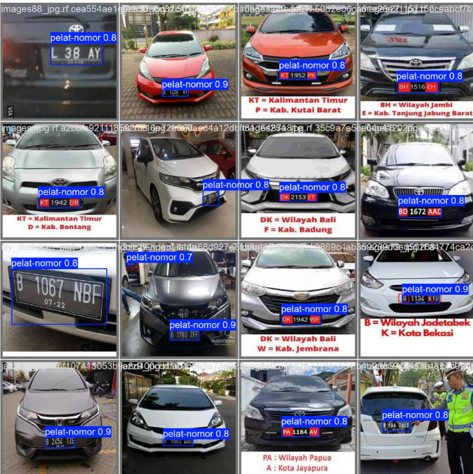
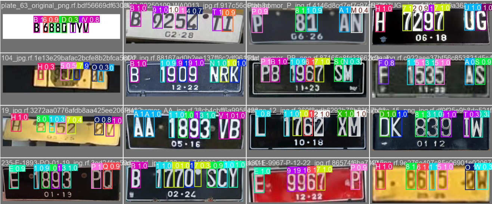
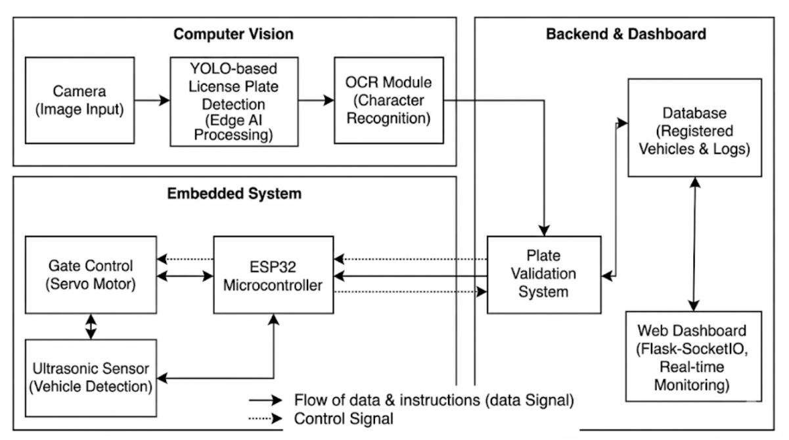
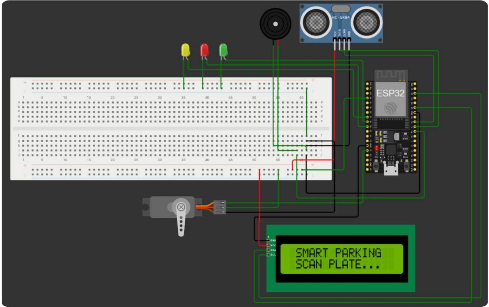
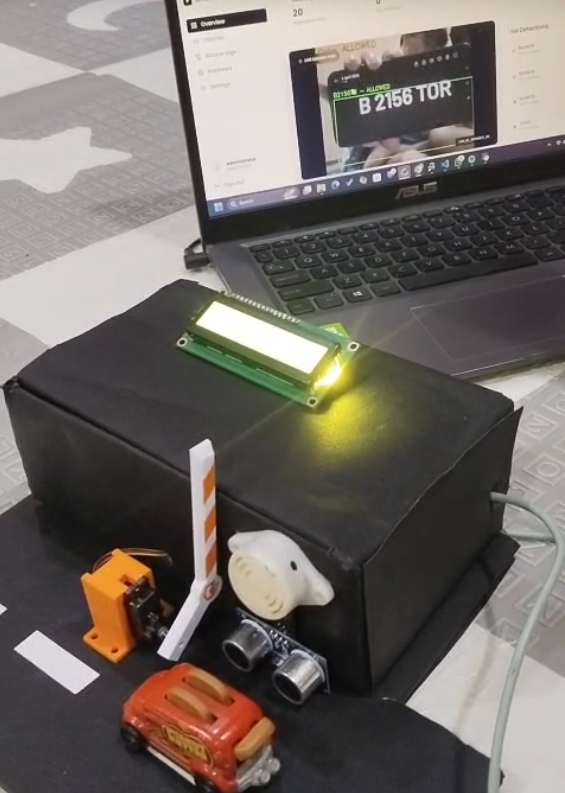

# Project Preview

<p align="center">
  
</p>

---

# Overview

The Smart Parking System is an Edge AI-powered parking management solution that integrates Computer Vision, Optical Character Recognition (OCR), Internet of Things (IoT), and embedded systems to automate vehicle identification, gate control, and real-time parking monitoring.

Unlike conventional cloud-based systems, this project performs license plate recognition locally using YOLO-based object detection and OCR, reducing latency while improving system responsiveness. The recognized license plate is validated against registered vehicles before controlling an ESP32-based automated parking gate.

The system also includes a real-time web dashboard built with Flask-SocketIO, enabling administrators to monitor parking occupancy, vehicle logs, hardware status, and gate operations from a centralized interface.

---

# Features

- Real-time license plate detection
- License plate recognition using YOLO and OCR
- Edge AI local inference
- ESP32-based automated gate control
- Ultrasonic safety sensor
- Vehicle registration and access logging
- Real-time parking occupancy monitoring
- Hardware diagnostics
- Manual gate control
- Web dashboard using Flask-SocketIO

---

# Dashboard

<p align="center">
  
</p>

The dashboard provides real-time monitoring of parking occupancy, vehicle registration, access logs, hardware diagnostics, and manual gate control.

---

# License Plate Detection

<p align="center">
  
</p>

The system detects Indonesian license plates in real time using a YOLO-based object detection model.

---

# Optical Character Recognition

<p align="center">
  
</p>

After the license plate is detected, a YOLO-based OCR model recognizes each character and reconstructs the complete license plate number.

---

# System Architecture

<p align="center">
  
</p>

The system integrates three major subsystems:

- Computer Vision Module
- Embedded Hardware Controller (ESP32)
- Web-Based Monitoring Dashboard

### Workflow

```text
Vehicle Arrival
        │
        ▼
 Ultrasonic Sensor
        │
        ▼
 Camera Capture
        │
        ▼
 YOLO License Plate Detection
        │
        ▼
 OCR Character Recognition
        │
        ▼
 Vehicle Validation
        │
        ▼
 ESP32 Controller
        │
        ▼
 Servo Motor Gate
        │
        ▼
 Dashboard & Database
```

---

# Hardware Wiring

<p align="center">
  
</p>

The wiring diagram illustrates the connection between the ESP32, ultrasonic sensor, servo motor, camera, LEDs, buzzer, and LCD display.

---

# Model Performance

| Task | Model | Result |
|------|-------|--------|
| License Plate Detection | YOLOv8s | mAP50 = **0.981** |
| License Plate Detection | YOLOv11n | mAP50 = **0.983** |
| OCR | YOLOv8n | mAP50 = **0.956** |
| OCR | YOLOv11n | mAP50 = **0.949** |

---

# Technology Stack

| Category | Technologies |
|----------|--------------|
| Programming | Python, JavaScript |
| AI | YOLOv8, OCR |
| Computer Vision | OpenCV |
| Backend | Flask, Flask-SocketIO |
| Embedded System | ESP32 |
| Communication | Serial Communication |
| Frontend | HTML, CSS, JavaScript |
| Database | SQLite |

---

# Demo

Click the image below to watch the complete prototype demonstration.

<p align="center">
  <a href="YOUR_VIDEO_LINK">
    
  </a>
</p>

---

# Installation

Clone the repository

```bash
git clone https://github.com/tintinbunyispeda/smart-parking-system.git
```

Navigate to the project directory

```bash
cd smart-parking-system
```

Install dependencies

```bash
pip install -r requirements.txt
```

Run the application

```bash
python app.py
```

---

# Future Improvements

- Multi-camera support
- Cloud database synchronization
- Mobile application
- AI-based parking occupancy prediction
- RFID integration
- Notification system

---

# Contributors

- Cristine Valentina
- Muhammad Faris Sakhi Ashari
- Reyner Orlando Winata
- Pascal Ahmad Zen
- Yozabel Hamuda

---

# Author

**Cristine Valentina**

Bachelor of Informatics, President University

- LinkedIn: https://linkedin.com/in/cristine-valentina
- Portfolio: https://cristinevalentina-portofolio-one.vercel.app
- GitHub: https://github.com/tintinbunyispeda